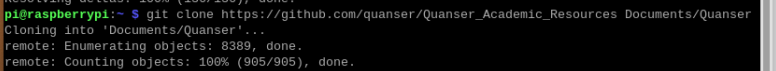
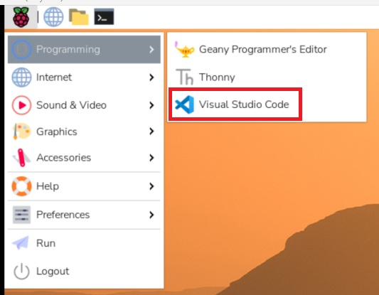
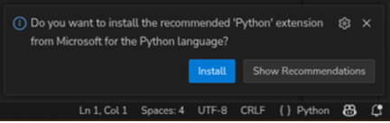
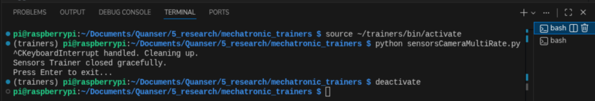
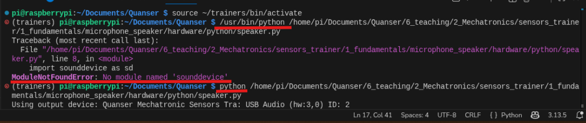
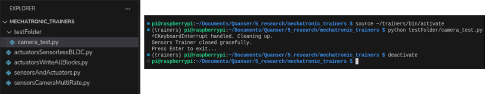

# Setting Up a Raspberry Pi to use the Mechatronic Sensors and Actuators Trainers

This document explains how to prepare a Raspberry Pi (4 or 5) for use with the 
Mechatronic Sensors and Actuators Trainers. It covers SD card preparation, 
initial Pi setup, installing Quanser libraries and system packages, 
creating a Python virtual environment, and running example content.

## Table of Contents

- [Setting up the SD Card](#setting-up-the-sd-card)
- [Initial Raspberry Pi Setup](#pi-setup)
- [Installing Quanser's Libraries & Setting Up the Pi](#installation)
    - [Downloading Teaching/Research Content](#downloading-content)
    - [Setting Up the System](#system-setup)
    - [Setting Up a Virtual Environment](#venv-setup)
    - [Final Step](#final-step)
- [Running Content](#running-content)
- [Using the Raspberry Pi](#using-the-raspberry-pi)
    - [Using a Virtual Environment](#using-a-virtual-environment)
    - [Rebooting and Shutting Down the Pi](#powering-pi)

The following guide has been tested with a Raspberry Pi 4 and 5
and includes steps on how to set up your device so you are ready
to start using our resources.

**Quick start checklist**
- Prepare a 32GB (or larger) SD card and SD card reader
- Have a suitable power supply (see Hardware checklist)
- Ensure you have network access (Wi‑Fi or Ethernet)

**Hardware checklist**
- Raspberry Pi 4 or 5
- USB-C power supply capable of supplying at least 3A (5V) for Pi 4/5
- 32GB (or larger) microSD card
- micro-HDMI to HDMI cable for the display
- USB keyboard and mouse (or Bluetooth alternatives)

## Setting up the SD Card
<a id="setting-up-the-sd-card"></a>

If you have already created a 64-bit Raspberry Pi OS image for your Raspberry Pi 
make sure the OS version is at least Bookworm and continue the setup by
going to [Pi Setup](#pi-setup).

You will set up your Raspberry Pi using the *Raspberry Pi Imager* 
utility; download from the [Raspberry Pi Website](https://www.raspberrypi.com/software/ ). 

Use the provided 32GB SD Card with the Raspberry Pi or any SD card 
you have available with over 16GB of storage. 

1. Insert the SD card in the computer you are using, use an adapter if needed. 

2. Open the Raspberry Pi Imager. 

3. When asked to `Choose Device` choose your Raspberry Pi version, 
either Raspberry Pi 5 or Raspberry Pi 4. 

4. When asked to `Choose OS` choose `Raspberry Pi OS (64-bit)`, 
it should be the recommended option. 

5. When asked to `Choose Storage` choose the SD card you inserted. 

6. Click Next. When asked if you 'Would Like to apply OS 
  customisation settings' click `Edit Settings`.

    a. Under General, if you know which Wi-Fi network you will want to connect to, 
    select 'Configure wireless LAN' and write the name and password for that network.

    b. You can also set a username and password when logging in. 
    Default device username and passwords are  `pi` and `raspberry` respectively.

    d. Click Save.

    e. When asked 'Would you like to apply OS customisation settings?' select `Yes`

7. You will be prompted to accept that all data in the SD card will be deleted. 
Click `Yes` to continue.

8. Once it is finished, it will say `Write Successful`. 
You can now remove the SD card from the computer and insert it into the Raspberry Pi.

## Initial Raspberry Pi Setup
<a id="pi-setup"></a>

These instructions are for the first time the Pi is turned on with a freshly 
flashed SD Card, if you have already gone through the initial setup (with at least Bookworm OS), 
go to [installation & setup](#installation).

Connect your Pi to a display using a micro HDMI to HDMI cable. 
Power it using a suitable power supply for the Pi and connect a keyboard and mouse 
using the USB ports on the device. If using a Bluetooth mouse and keyboard, 
instructions will appear on the screen. 

1. You will see a `Welcome to the Raspberry Pi Desktop` message, you will follow 
the instructions there. 
2. In the `Set Country` window, select your corresponding information, 
this will modify the language of the Pi and the time zone. 
If using a US keyboard, select that option too. Click `Next`.
3. In the `Create User` window, select a username and password. 
If you want to easily remember them, default device username and passwords 
are  `pi` and `raspberry` respectively. Click `Next`. 
It will prompt you that those are default passwords, it is okay. 
4. In the `Select Wi-Fi Network` choose which network to connect 
if you are not connected to one. Do not skip this step unless you will 
connect your Pi through a wired connection. You will need internet 
for the next sections. Click `Next`, 
enter the password to your network and click `Next`.
5. In the `Choose Browser` choose your preferred web browser. Click `Next`.
6. We recommend updating software in the next window if you can. 
Should take around 5-10 minutes. 
7. You should now have finished your setup. 
Click `Launch` to launch the desktop. 
8. Once you see the desktop, click on the raspberry icon 
on the top left corner and click on Preferences>Control Centre:

    a. Go to Interfaces, turn on SSH and VNC, this will allow you to remote into 
    your Pi later on. For these settings to apply you will have to 
    reboot your Pi (not urgent right now).

## Installing Quanser's Libraries & Setting Up the Pi
<a id="installation"></a>


### Downloading Teaching/Research Content
<a id="downloading-content"></a>

Clone the [Quanser_Academic_Resources Repository](https://github.com/quanser/Quanser_Academic_Resources) 
into a `Documents/Quanser` folder in the Pi and by using the following command:

```console
git clone https://github.com/quanser/Quanser_Academic_Resources Documents/Quanser
```




### Setting Up the System 
<a id="system-setup"></a>

We have developed a script to help you set up your system to install 
necessary libraries in your Pi. 

The script that will be run next will do the following steps:

1. update `~/bashrc` to add `PYTHONPATH` and `QAL_DIR` locations at 
the top of the file. These are needed so when running content, the
device knows where to find the provided libraries.

2. Using the Debian package installer (`apt`), the following libraries will get installed:

    - `wget, ca-certificates, gnupg, python3-venv, python3-numpy, python3-pip`

3. Configure the Quanser SDK repository for where to find the 
files for a Raspberry Pi OS 64-bit system. 
    - It will create a marker file so that if the script is ever run again, 
    it does not try to set up the repository again, just updates from the same location. 

4. It will use the Debian package installer (`apt`) to install:
    - `quanser-sdk,  python3-quanser-apis`

5. Update xpad to use the device as a gamepad.

6. Using the Debian package installer (`apt`), additional libraries will get installed:
    - `libportaudio2 ,python3-opencv, python3-pyqt6, python3-pyqtgraph, 
    qt6-wayland, python3-scipy, python3-matplotlib, python3-pandas, joystick`


7. Update `~/.profile` to change Qt settings to force Qt to use X11 and 
disable GTK theming and use Fusion (built-in Qt renderer). 
This keeps everything X11 compatible, 
avoids GTK2, works over VNC, remote desktop and HDMI 
and eliminates extra prints in the terminal. This is needed for a cleaner 
terminal when using scoping.

8. Install `VS code` using the Debian package installer
    - Open VS code (just so it appears later as a programming tool in the drop down home menu)


Go to the setup/raspberry_pi folder located in `Documents/Quanser/1_setup/raspberry_pi`.
You can do this either on a terminal or on the File Manager.

**Open a terminal in that directory and run the following commands:**

```console
chmod +x system_setup.sh
./system_setup.sh
```

**IMPORTANT:**
- This script uses sudo and may prompt for your password.
- After it finishes, it is recommended to open a NEW terminal
  before continuing.


### Setting Up a Virtual Environment
<a id="venv-setup"></a>

We have developed a script to help you create a Python 
virtual environment with access to system-installed Raspberry Pi OS and Python packages.  

Note that newer versions of Raspberry Pi OS and Python only allow libraries 
installed through `pip` to be installed 
inside a virtual environment. This section will create a 
virtual environment for that. 

Go to the setup/raspberry_pi folder located in `Documents/Quanser/1_setup/raspberry_pi`.
You can do this either on a terminal or on the File Manager.

This file will create a virtual environment called trainers 
in the home directory (`~/trainers`). If you want a different name or location, do this:

1. Right click the `venv_setup.sh` to open it. 
You can open it in `VS Code` or in a text editor. 

2. Scroll down to the User Configuration Section.

3. Modify `VENV_BASE_DIR` with your desired location for your virtual environment. 

4. Modify `VENV_NAME` with your desired name for your virtual environment.

5. Save your changes and close the file. 

The script that will be run next will do the following steps:

1. Create a virtual environment in the desired location (`~/trainers` by default).

2. Install using `pip` the libraries that can 
not be installed using Debian packages. These are:
    - `sounddevice, soundfile`

3. It will print how to activate the venv in the future. 
If the file was not modified, the venv 
will be able to be activated using the following command:

    ```console
    source ~/trainers/bin/activate
    ```

**Open a terminal in the setup/raspberry_pi directory and run the following commands:**

```console
chmod +x venv_setup.sh
./venv_setup.sh
```

**IMPORTANT:**
- As of right now, the venv will only need to be used to run files
that use the microphone and/or speaker in the Mechatronic Sensors Trainer
- For more information see [Using a Virtual Environment](#using-a-virtual-environment).

### Final Step
<a id="final-step"></a>

To make sure all the changes are saved properly, restart your Raspberry Pi using:

```console
sudo reboot
```

## Running Content 
<a id="running-content"></a>

After setting up your system in the previous section, 
you should be ready to start running content. This section will reference content
for the Actuators and Sensors Trainers:

**NOTE:** For running any example that uses the microphone/speaker, you will need to be
using a virtual environment. See [Using a Virtual Environment](#using-a-virtual-environment).

Open VS Code, either from the start menu or by typing `code` in a terminal. 



Open your Quanser folder (located in `~/Documents/Quanser`). 

If using the Mechatronic Sensors or Actuators Trainers:

1. If you have never used them, start with the files 
for your device in `2_quick_start_guides`.

2. You can start with the teaching content in `6_teaching/2_Mechatronics` 
to see lab guides and code for the Mechatronic Sensors and Actuators Trainers. 

3. You can also view examples in `5_research\mechatronic_trainers` that use
each of the devices individually or together to get a sense on how to start 
doing things that are not taught in the fundamental labs. These include:
    - Actuators: Using the BLDC motor in sensorless mode
    - Actuators: Write to all blocks at the same time, useful as a 
    reference for when using multiple of the same motor
    - Sensors: Use camera and sensors at the same time and do tasks 
    at different rates. Useful when processing a sensor needs to happen at
    different speeds but the system still needs to run at a specific rate. 
    - Sensors and Actuators together: How to use both systems in the same 
    program. Example reads encoder from the Sensors device and uses it to 
    control the speed of a DC motor connected to the Actuators device.


Note that the first time you open a Python file in VS Code it will prompt you
to install the Python extension. Please install it. This will enable a play button
at the top right corner of your VS code allowing you to run code easier. 



## Using the Raspberry Pi
<a id="using-the-raspberry-pi"></a>

### Using a Virtual Environment
<a id="using-a-virtual-environment"></a>

You cannot install Python packages via pip system-wide on modern Linux, 
so using pip directly won’t work. 
Some of the libraries needed for our examples are not available 
through Debian’s package manager (apt), 
so we need to use a virtual environment to safely install them 
with pip in an isolated workspace, 
keeping dependencies contained and reproducible.

After setting up your system and a virtual environment by 
following the [previous section](#installation), your Pi should be ready to start
using a virtual environment.

For the Mechatronics Design Lab (Sensors and Actuators Trainers), 
a virtual environment is only needed for when the microphone 
and/or speaker are being used.

#### Opening and Closing a Virtual Environment
<a id="opening-venv"></a>

To open the virtual environment, you have to call `bin/activate` in the location
of your virtual environment. If you did not change the name or location from the
script in the [setting up a virtual environment](#venv-setup)
section, the command should be the following:

```console
source ~/trainers/bin/activate
```

You can verify that you are inside the virtual environment by looking at the 
name at the start of your terminal as shown in the picture below.



You can now run any commands you want inside the virtual environment. 

**NOTE:** You will not be able to use the play button to run Python
files in VS code, you will have to use the console to run the file by
typing the run command.

```console
python <file_name.py>
```

**NOTE:** If the play button does work, it will try to run using Python from 
`/usr/bin/python`. That will prevent the code from running since the pip libraries
are not installed there. Make sure to modify the run command so it just says `python`. 
This will ensure to use Python from the virtual environment.



Make sure you are in the right folder, if not, you have to use the relative 
or absolute file to the path as shown below. 

```console
python <path_to_file/file_name.py>
```



To close or get out of the virtual environment, either close the terminal or
use the following command:

```console
deactivate
```


### Rebooting and Shutting Down the Pi
<a id="powering-pi"></a>


To safely reboot the Raspberry Pi, use:

```console
sudo reboot
```

To safely power it off, use:

```console
sudo shutdown -h now
```

