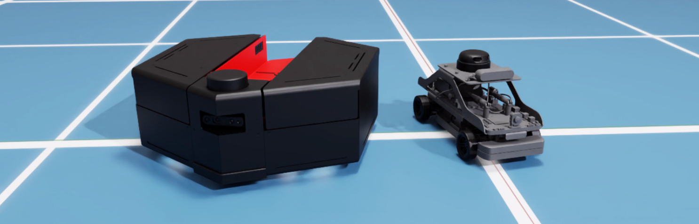

  

    
  

# System Configuration  
Isaac Sim offers a wide range of robot and environment configurations for training and validation. This documentation is compatible with Isaac Sim 5.1.0. For a complete breakdown of everything that’s possible within Isaac Sim please refer to the official NVIDIA  documentation [What Is Isaac Sim? — Isaac Sim Documentation](https://docs.isaacsim.omniverse.nvidia.com/5.1.0/index.html) 

## Host Computer Technical Specs 

### Software Requirements

The host computer must be configured with the following software:

- Ubuntu 24.04 LTS
- Isaac Sim 5.1.0 LTS  (See [Download Isaac Sim](https://docs.isaacsim.omniverse.nvidia.com/5.1.0/installation/download.html) & [Workstation Installation](https://docs.isaacsim.omniverse.nvidia.com/5.1.0/installation/install_workstation.html))

### Hardware Requirements

Hardware specifications should meet or exceed the official [Isaac Sim Requirements](https://docs.isaacsim.omniverse.nvidia.com/5.1.0/installation/requirements.html) from the Isaac Sim Documentation. 

**Reference System**

The examples in this documentation were validated using a system with the following configuration:

- Intel Core i7-12700KF (12th Gen)
-	32 GB RAM
-	NVIDIA RTX 4060

## Host Computer Dependencies 
Please review the [Isaac Sim Install Guide](https://docs.isaacsim.omniverse.nvidia.com/5.1.0/installation/download.html) for information on setting up the standalone launcher for your system.

Make sure to go through [Isaac Sim's ROS 2 Installation Guide](https://docs.isaacsim.omniverse.nvidia.com/5.1.0/installation/install_ros.html#isaac-sim-app-install-ros) for instructions on how to interface Isaac Sim with ROS2.

All examples require 'ROS Kilted', 'Nav2 bringup', 'ROS 2 Control' to be installed on the host machine. For detailed instructions:
-	ROS Kilted [Ubuntu (deb packages) — ROS 2 Documentation: Kilted documentation](https://docs.ros.org/en/kilted/Installation/Ubuntu-Install-Debs.html)
-	Nav2 [Getting Started — Nav2 1.0.0 documentation](https://docs.nav2.org/getting_started/index.html)
-	ROS 2 Control [Getting Started — ROS2_Control: Rolling Jan 2026 documentation](https://control.ros.org/rolling/doc/getting_started/getting_started.html#installation)

## Released Examples

- [QBot Platform](qbot_platform/README.md) 
- [QCar 2](qcar2/README.md) 