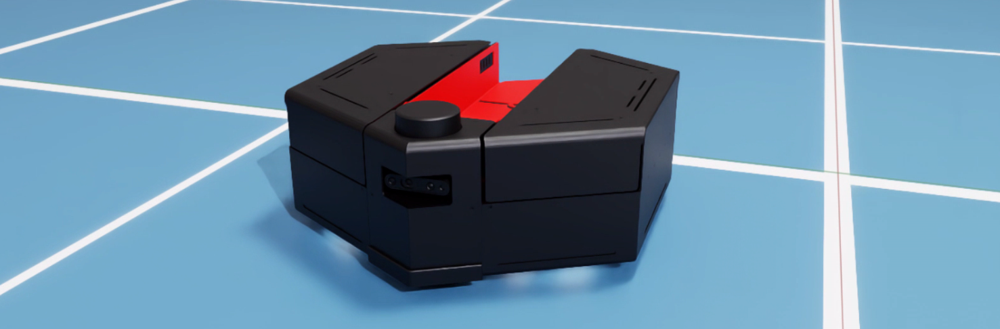
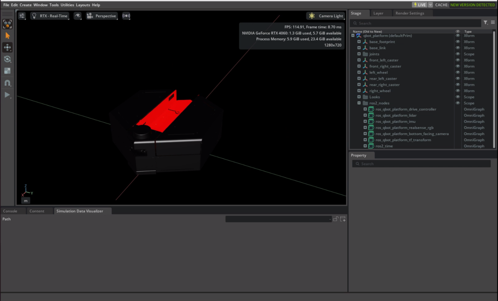
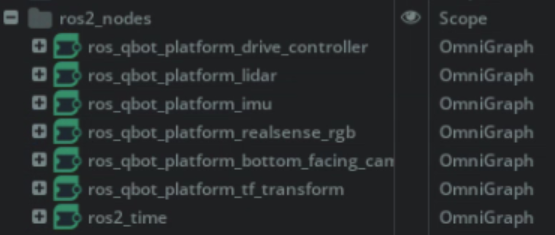
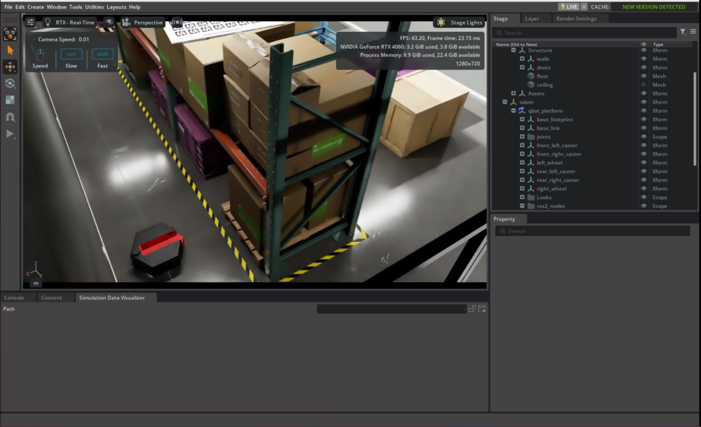
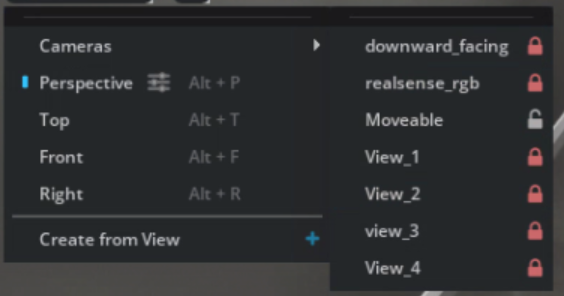
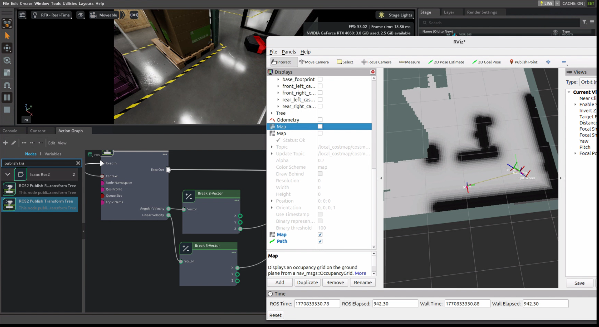

<div align="center" style="margin-bottom:24px;">
  <div style="width:100%; max-width:1000px; aspect-ratio: 3.5 / 1; overflow:hidden; border-radius:9px;">
    
  </div>
</div>

# QBot Platform Isaac

Download the usd files for the QBot Platform and its workspace from [this download link](https://quanserinc.box.com/shared/static/8fq3on0f1gphzv0gshqqgsulg8pyvkk3.zip).

This folder contains 3 folders:
- `individual_product_usd`: Contains a usd of the robot, where the default prim is the robot itself. Based on the URDF and includes all sensors.
- `isaac_lab`: tbd
- `isaac_sim`: Contains a usd of the robot in a warehouse environment where the robot can move around in the space. 

**NOTE**
 both the individual product usd and the isaac sim warehouse environment are collected as .zip files to ensure all assets are collected locally. When you unzip the files on your local system we recommend placing these files under the Documents/Quanser directory. Your local folder structure should look as follows: 

``` 
Documents
    L Quanser
        L qbot_platform_nvidia
                L individual_product
                L isaac_lab
                L isaac_sim 
```

## qbot_platform.usd

Based on the URDF of the QBot Platform located in [Quanser's urdf_representations repository](https://github.com/quanser/urdf_representations). Has collision volumes defined for the wheels and the body of the robot.


Includes:

- Joint limits and specifications/parameters defined in the usd.
- Camera views from bottom facing camera and the RealSense's RGB sensor calibrated to match the location and the sensors on the physical robot.  
- LiDAR sensor to match the specifications of the QBot Platform's Leishen M10p.
- IMU sensor located at the same location as the IMU of the QBot Platform.



--- 

### Included ROS2 Graphs:



- `ros2_time`: publishes the simulation time from isaac sim.
    - topic: `clock` &emsp; type: `[rosgraph_msgs/msg/Clock]`.

- `ros_qbot_platform_imu`: publishes the laser scan from the **IMU** sensor.  
    - topic: `imu` &emsp; type: `[sensor_msgs/msg/IMU]`.

- `ros_qbot_platform_lidar`: publishes the laser scan from the **Lidar** sensor.  
    - topic: `scan` &emsp; type: `[sensor_msgs/msg/LaserScan]`.
    
- `ros_qbot_platform_realsense_rgb`: publishes camera images from the **realsenseRGB** sensor.  
    - topic: `realsense_rgb` &emsp;  type: `[sensor_msgs/msg/Image]`.

- `ros_qbot_platform_bottom_facing_camera`: publishes camera images from the **bottom_facing_camera** sensor.  
    - topic: `csi_front` &emsp; type: `[sensor_msgs/msg/Image]`.

- `ros_qbot_platform_drive_controller`: subscribes to a **twist** message which publishes linear and angular velocity commands to move the robot.
    - topic: `cmd_vel_twist`  &emsp; type: `[geometry_msgs/msg/Twist]`.

- `ros_qbot_platform_tf_transform`: publishes odometry from an **odom** frame and the transform tree from the **odom** frame to the **base_link** of the robot. 
    - topic: `odom` &emsp; type: `[nav_msgs/msg/Odometry]`.
    - topic: `tf` &emsp;&emsp; type: `[tf2_msgs/msg/TFMessage]`.

## qbot_platform_workspace.usd

qbot_platform_Workspace imports a small warehouse environment (as part of the omniverse assets) with a reference to the `qbot_platform.usd`.




If you want to drive the robot around the space using the keyboard, you can use the ros package and node [teleop_twist_keyboard](https://docs.ros.org/en/kilted/p/teleop_twist_keyboard/) to convert keyboard commands to twist which will be read by the `ros_qcar2_drive_controller` graph.

To install:
```
sudo apt-get install ros-<version>-teleop-twist-keyboard
```

To run:
```
ros2 run teleop_twist_keyboard teleop_twist_keyboard --remap /cmd_vel:=/cmd_vel_twist
```

Make sure speed is <2 and turn is set to around 0.4. 

To start it with speed of 1.0 and turn of 0.4, use instead:
```
ros2 run teleop_twist_keyboard teleop_twist_keyboard --ros-args -p speed:=1.0 -p turn:=0.4
```

As part of the virtual warehouse environment we also include 4 static views and a movable camera 




### Isaac Sim with Nav2 Integration 
--- 



As part of the provided integration with Isaac Sim we also provide an example of using Nav2 to set desired waypoints for autonomous mapping and navigation. 

Provided is the directory `qbot_platform_isaac_nav2` which contains the following launch files:
- qbot_platform_cartographer_launch.py
- qbot_platform_slam_and_nav_bringup_launch.py

`qbot_platform_cartographer_launch.py` uses the `qbot_platform_2d.lua` inside the `/config` folder to configure the parameters used by the ros2 cartography package. 

`qbot_platform_slam_and_nav_bringup_launch.py` uses the `qbot_platform_slam_and_nav.yaml` inside the `/config` folder to configure the behaviour tree required by nav2 bringup to initialize automous navigation of an unknown space. 

***Runing the example***
1. Start the Isaac sim environment to ensure the ros2 nodes for the qbot platform are publishing data correctly.
2. Open a new terminal session (source ros2 kilted if it's not part of the ~/.bashrc)
3. Create a ros2 workspace using the following command 
    ```
    mkdir ros2_workspace/src
    ```
4. Copy `qbot_platform_isaac_nav2` inside `ros2_workspace/src`. The directory structure should look like:
    ``` 
    ros2_workspace
        L src
            L qbot_platform_isaac_nav2
                    L behaviour_trees
                    L config
                    L launch
                    L resource
                    L rviz
                    L src
                    L CMakeLists.txt
                    L LICENSE
                    L setup.cfg
                    L setup.py 
    ``` 
5. Navigate to the top of the ros2 workspace and compile with the command 
    ```
     colcon build  
    ```
6. Source the workspace using the command
    ```
    source install/setup.bash
    ```
7. Run the launch file for `qbot_platform_slam_and_nav_bringup_launch.py` to start the nav2 system
    ```
    ros2 launch qbot_platform_isaac_nav2 qbot_platform_slam_and_nav_bringup_launch.py
    ```
8. Open up `rviz2`
7. Load the preset rviz configuration (qbot_platform_nav2.rviz) to setup your visualized world
8. Click on  `2D goal pose` to send a desired position command to the nav2 system  