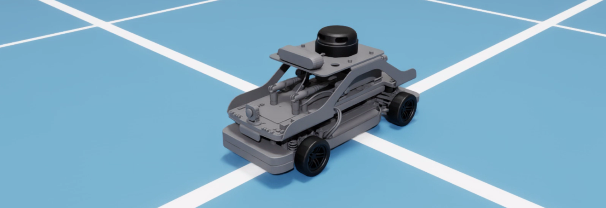
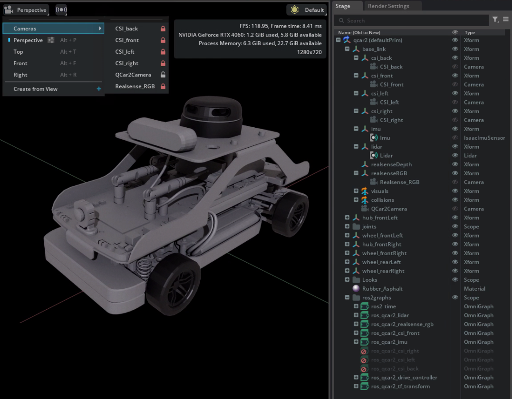
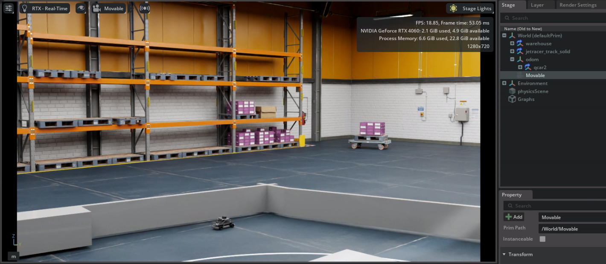
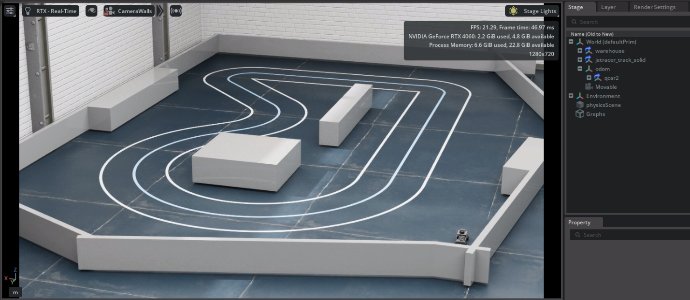
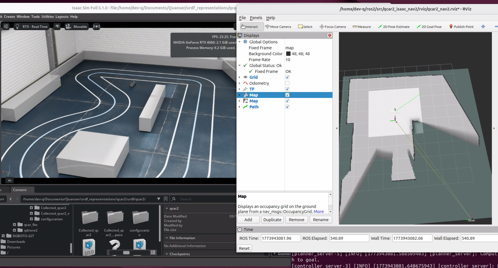

<div align="center" style="margin-bottom:24px;">
  <div style="width:100%; aspect-ratio: 3.5 / 1; overflow:hidden; border-radius:9px;">
    
  </div>
</div>
<!--  -->

# QCar 2 Isaac
Download the usd files for the QCar2 and its workspace from [this download link](https://quanserinc.box.com/shared/static/ot6txf8lx5e95qnv1dxxnuh9zvm7puo6.zip).

This folder contains 3 folders:
- `individual_product_usd`: Contains a usd of the robot, where the default prim is the robot itself. Based on the URDF and includes all sensors.
- `isaac_lab`: tbd
- `isaac_sim`: Contains a usd of the robot in a warehouse environment where the robot can move around in the space. 

**NOTE:**
 Both the individual product usd and the isaac sim warehouse environment are collected as .zip files to ensure all assets are collected locally. When you unzip the files on your local system we recommend placing these files under the Documents/Quanser directory. Your local folder structure should look as follows: 

``` 
Documents
    L Quanser
        L qcar2_nvidia
            L individual_product
            L isaac_lab
            L isaac_sim 
```

For information about computer specs and how to get things ready to run examples, see [Isaac Sim's folder README](../README.md).

## QCar2.usd

Based on the URDF of the QCar2 located in [Quanser's urdf_representations repository](https://github.com/quanser/urdf_representations). Has collision volumes defined for the wheels and the body of the robot.


Includes:

- Joint limits and specifications/parameters defined in the usd.
- Camera views from all 4 csi cameras and the RealSense's RGB sensor calibrated to match the location and the sensors on the physical robot. 
- Camera view trailing the QCar2. 
- LiDAR sensor to match the specifications of the QCar's RPLIDAR A2M12.
- IMU sensor located at the same location as the IMU of the QCar.



--- 

### Included ROS2 Graphs

The following Omnigraphs are defined under 'qcar2/ros2graphs'. When the simulation is running, they use the ROS2 Bridge to publish and subscribe to ROS2 nodes.

- `ros2_time`: publishes the simulation time from isaac sim.
    - topic: `clock` &emsp;  type: `[rosgraph_msgs/msg/Clock]`.

- `ros_qcar2_imu`: publishes the laser scan from the **IMU** sensor.  
    - topic: `imu` &emsp;  &emsp;type: `[sensor_msgs/msg/IMU]`.

- `ros_qcar2_lidar`: publishes the laser scan from the **Lidar** sensor.  
    - topic: `scan`&emsp; &emsp;type: `[sensor_msgs/msg/LaserScan]`.
    
- `ros_qcar2_realsense_rgb`: publishes camera images from the **realsenseRGB** sensor.  
    - topic: `realsense_rgb` &emsp;type: `[sensor_msgs/msg/Image]`.

- `ros_qcar2_csi_front`: publishes camera images from the **csi_front** sensor.  
    - topic: `csi_front` &emsp;type: `[sensor_msgs/msg/Image]`.

- `ros_qcar2_csi_left`: publishes camera images from the **csi_left** sensor. NOTE: It is Deactivated by default, to activate it, right click the graph and click _Activate_.    
    - topic: `csi_left` &emsp;type: `[sensor_msgs/msg/Image]`.

- `ros_qcar2_csi_right`: publishes camera images from the **csi_right** sensor. NOTE: It is Deactivated by default, to activate it, right click the graph and click _Activate_.    
    - topic: `csi_right` &emsp;type: `[sensor_msgs/msg/Image]`.

- `ros_qcar2_csi_back`: publishes camera images from the **csi_back** sensor. NOTE: It is Deactivated by default, to activate it, right click the graph and click _Activate_.    
    - topic: `csi_back` &emsp;type: `[sensor_msgs/msg/Image]`.

- `ros_qcar2_drive_controller`: subscribes to a **twist** message to send as speed and steering angle to an Ackermann Controller to move the robot.
    - topic: `cmd_vel_twist`&emsp;type: `[geometry_msgs/msg/Twist]`.

- `ros_qcar2_tf_transform`: publishes odometry from an **odom** frame and the transform tree from the **odom** frame to the **base_link** of the robot. 
    - topic: `odom` &emsp; type: `[nav_msgs/msg/Odometry]`.
    - topic: `tf` &emsp;&emsp; type: `[tf2_msgs/msg/TFMessage]`.

#### Error with ros_qcar2_tf_transform

When referencing the qcar2 from a new world for the first time, you might get athe following error: 

>'/World/odom/qcar2/ros2graphs/ros_qcar2_tf_transform/ros2_publish_transform_tree_01: [/World/odom/qcar2/ros2graphs/ros_qcar2_tf_transform] Please specify at least one valid target prim for the ROS pose tree component.'


This means it just lost the odom to base transformation. To fix it, first place the QCar 2 in the correct location under an odom frame. 
- Go to the 'ros2graphs' folder under the 'qcar2', expand 'ros_qcar2_tf_transform' and click on 'ros2_publish_transform_tree_01'. In the properties tab define:
    - parentPrim: the 'odom' frame
    - targetPrim: the 'qcar2/base_link'.

## qcar2_workspace.usd

QCar2_Workspace imports a warehouse environment (as part of the omniverse assets) with a reference to the `qcar2.usd`.



There is a camera called 'movable' defined in the space, as the name suggests, use that one to move around to explore the space and view different locations.

A track with walls around it has been spawned in the space under the Xform `jetracer_track_solid`. The walls exist for lidar testing purposes. If the track xform is disabled, the track and walls disappear and the car can drive everywhere in the warehouse. There is a fixed camera 'cameraWalls' (under the xform) that is fixed to the view below to observe the whole track.

If the stage is started using the play button to the left, the robot should fall to touch the floor and stay there. Once that happens, it starts publishing the data from ROS as described in the described in the [Included ROS2 Graphs](#included-ros2-graphs) section.



If you want to drive the robot around the space using the keyboard, you can use the ros package and node [teleop_twist_keyboard](https://docs.ros.org/en/kilted/p/teleop_twist_keyboard/) to convert keyboard commands to twist which will be read by the `ros_qcar2_drive_controller` graph.


To install:
```
sudo apt-get install ros-<version>-teleop-twist-keyboard
```

To run:
```
ros2 run teleop_twist_keyboard teleop_twist_keyboard --ros-args -r /cmd_vel:=/cmd_vel_twist
```

Make sure speed is <2 and turn is set to around 0.4. 

To start it with speed of 1.3 m/s and turn of 0.45, use instead:
```
ros2 run teleop_twist_keyboard teleop_twist_keyboard --ros-args -p speed:=1.3 -p turn:=0.45 -r /cmd_vel:=/cmd_vel_twist
```

### Isaac Sim with Nav2 Integration 
--- 

> [!NOTE]
> **All examples have been written for and tested with ROS2 Kilted.**  



As part of the provided integration with Isaac Sim we also provide an example of using Nav2 to set desired waypoints for autonomous mapping and navigation. 

Provided is the directory `qcar2_isaac_nav2` which contains the following launch files:
- `qcar2_cartographer_launch.py`: uses the `qcar2_2d.lua` inside the `/config` folder to configure the parameters used by the ros2 cartography package. 
- `qcar2_slam_and_nav_bringup_launch.py`: uses the `qcar2_slam_and_nav.yaml` inside the `/config` folder to configure the behaviour tree required by nav2 bringup to initialize autonomous navigation of an unknown space. 


***Runing the example***
1. Start the Isaac Sim Warehouse environment to ensure the ros2 nodes for the qcar2 are publishing data.

2. Open a new terminal session (source ros2 kilted if it's not part of the ~/.bashrc) `source /opt/ros/kilted/setup.bash`

3. Create a ros2 workspace using the following command 
    ```
    mkdir ros2_workspace/src
    ```

4. Copy `qcar2_isaac_nav2` inside `ros2_workspace/src`. The directory structure should look like:
    ``` 
    ros2_workspace
        L src
            L qcar2_isaac_nav2
                L config
                L launch
                L rviz
                L src
                L CMakeLists.txt
                L LICENSE
                L package.xml
                L setup.cfg
                L setup.py 
    ```

5. Navigate to the top of the ros2 workspace and compile with the command: 
    ```
     colcon build  
    ```

6. Source the workspace using the command:
    ```
    . install/setup.bash
    ```

7. Run the launch file for `qcar2_slam_and_nav_bringup_launch.py` to start the nav2 system:
    ```
    ros2 launch qcar2_isaac_nav2 qcar2_slam_and_nav_bringup_launch.py 
    ```
    NOTE: The first time running this file, it might fail. Try running it again if that happens. 

8. Open up RViz by launching it from another terminal using the command: `rviz2`.

9. Load the preset RViz configuration (`qcar2_isaac_nav2/rviz/qcar2_nav2.rviz`) to setup your visualized world.

10. In RViz, click on  `2D goal pose` to send a desired position and rotation command to the nav2 system.  


