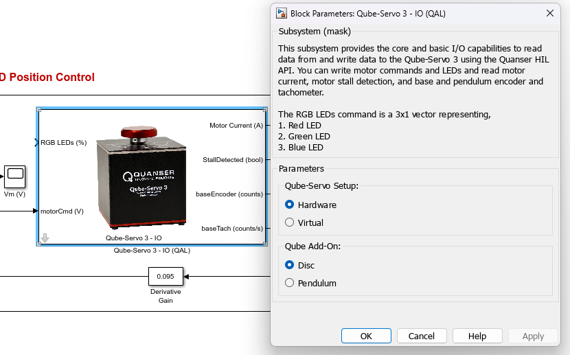
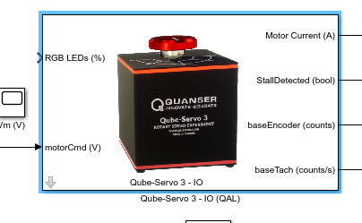
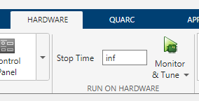
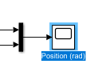
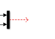
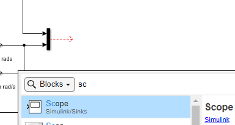
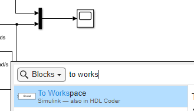
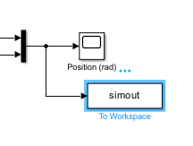

# Troubleshooting Guide for Qube-Servo 3

## Table of Contents

- [Unable to Run Virtual Files](#unable-to-run-virtual-files)
- [Simulink Scopes Are Not Updating Live](#simulink-scopes-are-not-updating-live)

## Unable to Run Virtual Files

**Error:** When running files from a lab's `digital_twin/matlab` folder, you may see 
`The 'Active during normal simulation' feature is not available`.

**Cause:** The `digital_twin` folder is designed for users who *only* have the digital twin installed and do not have a QUARC license. On machines with a hardware setup, Quanser files cannot be run through Simulink's `Simulation` tab.

**Fix:** To run files in virtual mode on a machine that also supports hardware, use the hardware files and modify them for virtual by following these steps:

1. Open the Simulink model from the `hardware/matlab` folder instead.
 

2. Double-click the Qube-Servo 3 block and change the `Qube-Servo Setup` from `Hardware` to `Virtual`, then click `OK`.
    

    
    

3. The block image should now display a virtual Qube, as shown below.
    

    
    

4. You can now run the model as usual using the `Monitor & Tune` button under the `Hardware` tab. The code will run on the virtual Qube.
    

    
    

## Simulink Scopes Are Not Updating Live

**Error:** Starting with MATLAB 2025a, a bug was introduced where scopes sometimes only refresh after the model is stopped, rather than updating during execution.

**Cause:** This is most likely triggered with the built-in "save to workspace" and "limit points" options on a scope block.

**Fix:** Delete and replace the affected scope(s) by following these steps:

1. If you want to keep the same scope name, copy it first, then delete the existing scope from the model.
    

     &emsp;&emsp; 
    

2. Double-click on an empty area in your model to open the search dialog, then search for and place a new `Scope` block.
    

    
    

 

3. Connect the new scope to the signal and rename it if needed.
 

4. If you need to save data to the workspace, do **not** use the scope's built-in "save to workspace" option — this is what triggers the bug.
Instead, add a `To Workspace` block and configure it to save the desired variable.
    

     &emsp;&emsp; 
    

