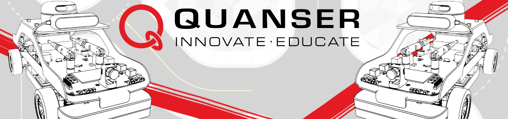

# Quanser_Academic_Resources
The Quanser Academic Resources includes the research and teaching content for using Quanser products, including libraries, research examples, teaching content, user manuals, guides and more.

This branch was created so you could download all files that are related to the Self Driving Car Studio which includes the `QCar and QCar 2` and that you can add to your QCar to start developing on the car itself.  If you are looking for resources for your PC, please refer to the [dev-windows](https://github.com/quanser/Quanser_Academic_Resources/tree/dev-windows) branch.

### Table of Contents
- [Downloading Resources](#downloading-resources)
- [Setting Up Your QCar](#setting-up-your-qcar)
- [Getting Started With Content](#getting-started-with-content)
- [Changelog](changelog.txt)

## Downloading Resources

Before getting started with these resources, the first step is to download them, this could be to your PC and then transferring to the QCar or directly to the QCar itself. 
 
### Downloading to your PC first

Download to PC

1. Click the green Code button at the top of this GitHub page, click _Download ZIP_ at the bottom of the menu that pops up. 
2. Unzip the folder in your system. 
3. Go into _Quanser_Academic_Resources-dev-qcar_ (you see the folders 0_libraries, 1_setup ...). 
4. Make sure you can ping your QCar using the IP it shows on its display. 
4. Download or open [WinSCP](https://winscp.net/eng/download.php)
5. Connect and move files using WinSCP to the QCar as follows:
    
    

    Where the host name is the IP of the QCar, username and password are `nvidia`.

    Double click the address bar on the left of window to open the directory where your downloaded resources are. 

    

    On the right side (the QCar directory side), go to `home/nvidia/Documents` and create a folder called `Quanser`. Copy the files from _Quanser_Academic_Resources-dev-qcar_ into this new folder by dragging and dropping from the left to the right window. 

    

    You can now close WinSCP.

### Downloading directly on the QCar

Downloading to QCar

1. On your system, create a folder called _Quanser_ under _Documents_. This should look like `C:/Users/user/Documents/Quanser`.
2. Click the green Code button at the top of this GitHub page, click _Download ZIP_ at the bottom of the menu that pops up. 
3. Unzip the folder in your system. 
4. Go into _Quanser_Academic_Resources-main_ (you see the folders 0_libraries, 1_setup ...). Copy all the contents of that folder into your newly created Documents/Quanser folder. 

## Setting Up Your QCar

Your QCar comes equipped with the necessary libraries that you might use as part of the existing examples, however, there is one step that you need to complete before starting to use your QCar. 

Connect to a QCar by HDMI cable or remote desktop (see [User Manual Connectivity](3_user_manuals/qcar2/user_manual_connectivity.pdf) for more help). Go into your documents in the QCar into your newly created Documents/Quanser folder from the steps above and go to `1_setup`. Run the  `updatebashrc_qcar2.sh` file located in that folder. It will make sure your QCar is ready for usage. 

## Getting Started With Content

For a comprehensive guide to getting started with these resources for the QCar 2, please refer to the [Getting Started - Labs](docs/start_labs.md) guide.
    
    - Self Driving Car Studio (SDCS):
        - QCar, QCar 2
        - Traffic Light

For information on setup for other products, please refer to the guide in the [dev-windows](https://github.com/quanser/Quanser_Academic_Resources/tree/dev-windows) branch.

