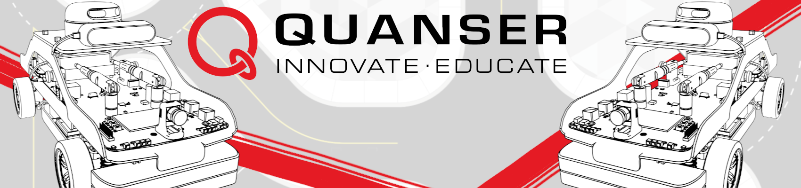
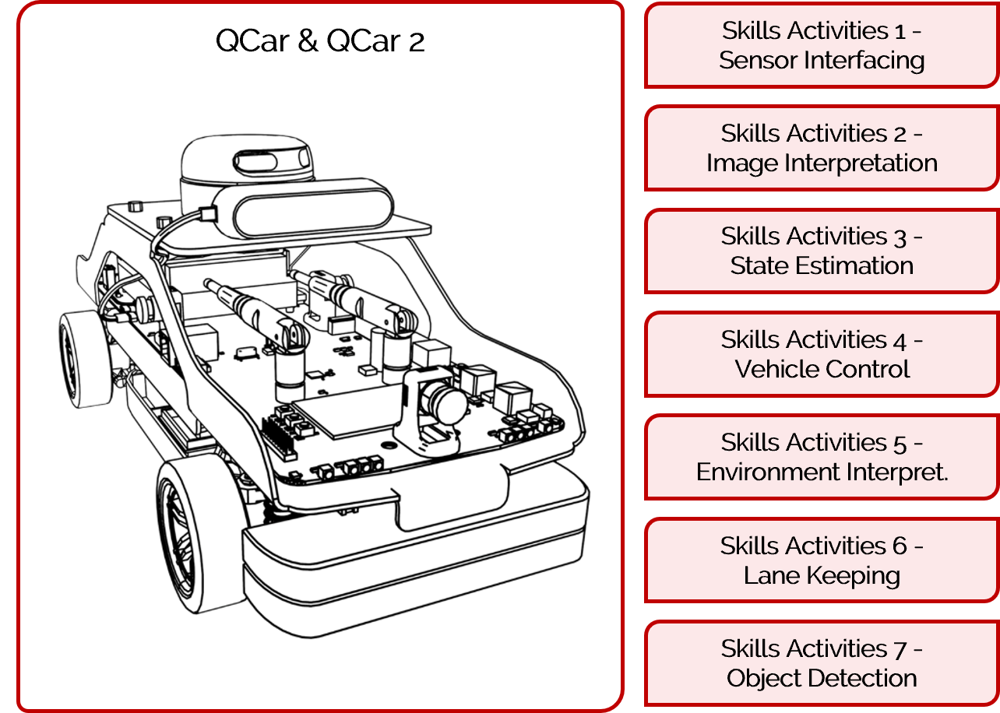
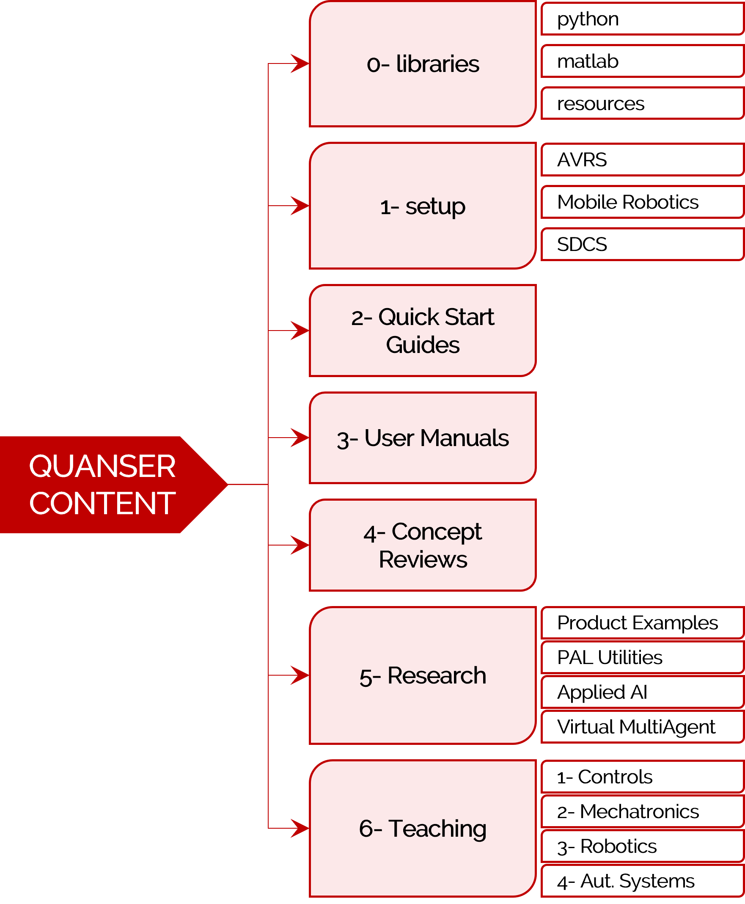

<a href="../README.md#getting-started-with-content">Back To Guide</a>
 

# Getting Started With Quanser Lab Products

This guide walks you through getting started with the [Self Driving Car Studio (SDCS)](#sdcs), which includes QCar, QCar 2

- For more information on the folders, see [Quanser's Directory Structure](#directory-structure).

## SDCS

The Self Driving Car Studio (SDCS) is a teaching and research lab for self driving using QCar. The steps to get started after having set up your computer are as follows:

1. Go through the welcome guide located in `1_setup/self_driving_car_studio`.

2. If you have QCar 2, run through the quick start guide  to make sure your hardware is functioning as expected. These files are located under `2_quick_start_guides/qcar2`. Note that also individual IO tests are located in the product folder under `5_research`.
3. Review the User Manuals under `3_user_manuals/`, read the user manuals for your QCar version (qcar or qcar2), as well as the user manual for the traffic light if you are going to be using it with your system. These will guide you through how to use your system, including interfacing of hardware and software. 
4. If you are using the systems for research, content is located under `5_research/sdcs`, it will have IO and research examples for all products of this lab. This content includes MATLAB, Python and ROS examples. Note that the full self driving examples are part of the teaching content.
5. If you are using the systems for teaching, content is located under `6_teaching/3_Robotics`. The self driving content available as part of skills progressions is shown below.

    

For a more detailed description of the provided file directory, go to the [Directory Structure](#directory-structure) section.

[Back to Top](#)   |   [Back to Guide](../README.md#getting-started-with-content)

## Directory Structure

Quanser content is subdivided into a series of directories to help you get started quickly. 

- **0_libraries**: Source location for custom Python/Simulink libraries, as well as other useful files used in the libraries. Please review `libraries_guide` inside the libraries folder for more information.

- **1_setup**: Setup for different lab products. 
- **2_quick_start_guides**: Standalone Quick Start Guides for various products. 
- **3_user_manuals**: PDF files of user manuals for different Quanser products.
- **4_concept_reviews**: Consists of .docx/.pdf files for background concepts utilized in Quanser Curriculum.
- **5_research**: Research and IO examples and in either Simulink/Python/ROS for different solutions provided by Quanser. (previously "examples" folder) 
- **6_teaching**: Curriculum/lab content for various Quanser products for hardware or digital twins. 

[Back to Top](#)   |   [Back to Guide](../README.md#getting-started-with-content)
